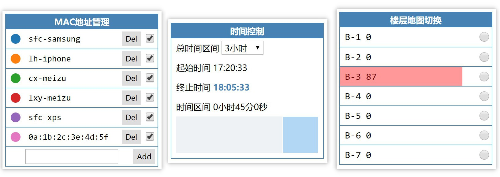

# location-viewer

定位数据查看器. 该工具用来在地图上查看移动设备的定位数据.

## 数据来源

目前该工具的数据是静态的. 地图数据在 static/floor/下, 定位点数据在static/allItems.json文件中. 

src/utils.ts中的`fetchFloorData(floorId: number)`用来获取楼层地图数据, 可以修改该方法来实现加载动态数据.

src/ItemCache.ts中`fetchData()`方法用来加载定位点数据. 可以修改该方法来实现加载其他数据. 如果要使用动态实时数据, 还得实现websocket相关逻辑.

## UI交互

该工具包括了三个控件: MAC地址管理控件, 时间控制控件, 楼层地图切换控件, 如上图所示.

### MAC地址管理控件

该控件用来配置设备MAC地址. 该列表中的MAC地址的定位数据才会显示在地图上. 列表每一行对应一个MAC地址, 行左边的圆形标记了该MAC地址的定位点在地图上的颜色. 行中间是MAC地址, MAC地址可以是别名(例如`sfc-samsung`), 也可以是真实的MAC地址(例如`0a:1b:2c:3e:4d:5f`). 行右边是删除按钮以及控制是否显示定位数据的选框.

该控件最下面的一行用来添加新的MAC地址.

**其他注意事项**

1. MAC地址在本工具中是大小写无关的, 不过在本工具里面统一使用小写; 
2. MAC地址别名目前只能在src/config.ts中进行配置.

### 时间控制控件

该控件用来控制查看的数据的时间范围. 总时间区间默认为3个小时; 当工具打开时, 会加载最近3个小时的数据, 用户可以通过控件下方的滑块来查看这3个小时中某个时间窗口内的数据. 起始时间表示的是滑块左边界对应的时间; 终止时间对应滑块有边界对应的时间; 时间区别表示滑块对应的时长.  可以只拖动滑块的左边界来调整起始时间(右边界同理). 时间控制控件每隔1秒会更新时间, 保持时间总是为最近3小时.

当滑块位于最右端时, 终止时间会变成蓝色并加粗, 表示**终止时间**对应当前时间. 当滑块位于其他位置时, 滑块的**起始时间/终止时间/时间区间**保持不变.

### 楼层地图切换控件

该控件用来切换楼层. 每一行对应一个楼层选项, 在楼层名称旁边有数字表示该楼层中的定位点的数量.  定位点的数量指的是, 在当前的MAC过滤条件与当前的时间过滤条件下, 一个楼层内的定位点的数量. 每一行的底层(z-index的底层)还会有长方形来表示一个楼层内的定位点数量, 长方形的背景色和长度也反映定位点数量.

## 图例说明

不写了, 好麻烦

## 开发

详见代码注释